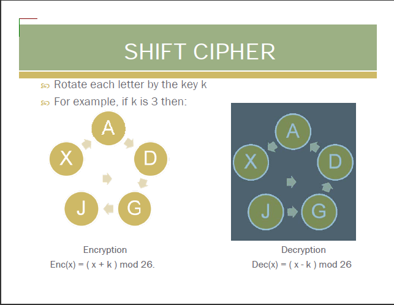

For a very brief theory of shift ciphers and their analysis, click [here](docs/shiftcipher.pdf)

The shift cipher, also known as the Caesar cipher, is one of the oldest and simplest encryption techniques. It was used by Julius Caesar to protect military communications. This cipher is a type of substitution cipher where each letter in the plaintext is shifted a certain number of positions down the alphabet.

### How It Works

1. **Key Space**: The key is a number between 0 and 25 (for English alphabet)
2. **Encryption**: Each letter is shifted by the key value
   - Example: With key=3, 'A' becomes 'D', 'B' becomes 'E', etc.
3. **Decryption**: Each letter is shifted back by the key value
   - Example: With key=3, 'D' becomes 'A', 'E' becomes 'B', etc.

### Mathematical Representation

- For encryption: c = (p + k) mod 26
- For decryption: p = (c - k) mod 26
  where:
- p is the plaintext letter (0-25)
- c is the ciphertext letter (0-25)
- k is the key (0-25)

### Security Analysis

The shift cipher has several weaknesses:

1. **Small Key Space**: Only 25 possible keys (excluding key=0)
2. **Vulnerable to Brute Force**: All possible keys can be tried quickly
3. **Frequency Analysis**: Letter frequencies in the ciphertext match those in the plaintext

### Breaking the Cipher

The shift cipher can be broken using:

1. **Brute Force Attack**: Try all possible keys
2. **Frequency Analysis**: Compare letter frequencies with standard English
3. **Known Plaintext Attack**: If part of the message is known
